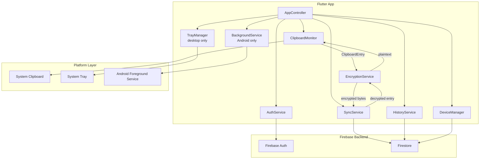

# Design Document: Universal Clipboard Sync

## Overview

Universal Clipboard Sync is a Flutter application that monitors the system clipboard on each authenticated device and synchronizes clipboard content across all devices in real time. All content is end-to-end encrypted on-device before being stored in Firebase Firestore, so neither the server nor Firebase can read the user's clipboard data.

The application targets Android, iOS, macOS, Linux, and Windows. On desktop platforms (macOS, Windows, Linux) it runs as a system tray application with no persistent main window. On Android it runs as a foreground service. On iOS it operates only while in the foreground due to platform restrictions.

### Key Design Goals

- Zero-friction background operation on desktop and Android
- End-to-end encryption with keys that never leave the device
- Real-time sync via Firestore listeners (no polling on supported platforms)
- Minimal memory and CPU footprint

---

## Architecture

The application is structured around five core services and a platform-specific clipboard monitor, coordinated by a top-level `AppController`.



### Data Flow: Outbound (copy on this device)

```
System Clipboard
  → ClipboardMonitor (event-driven)
  → EncryptionService.encrypt(entry)
  → SyncService.upload(encryptedEntry)
  → Firestore
```

### Data Flow: Inbound (copy on another device)

```
Firestore (real-time listener)
  → SyncService receives snapshot
  → filter: discard if deviceId == this device
  → EncryptionService.decrypt(encryptedEntry)
  → ClipboardMonitor.writeToClipboard(entry)  [suppresses re-capture]
  → System Clipboard
```

---

## Components and Interfaces

### AuthService

Wraps Firebase Authentication. Manages sign-in, registration, sign-out, and session state.

```dart
abstract class AuthService {
  Stream<User?> get authStateChanges;
  Future<void> register(String email, String password);
  Future<void> signIn(String email, String password);
  Future<void> signOut();
  Future<void> sendPasswordReset(String email);
  String? get currentUserId;
}
```

### ClipboardMonitor

Unified abstraction over platform-specific clipboard detection. Implementations differ per platform but expose the same interface.

```dart
abstract class ClipboardMonitor {
  Stream<ClipboardEntry> get onClipboardChanged;
  Future<void> writeToClipboard(ClipboardEntry entry);
  void suppressNextChange();   // called before writeToClipboard to prevent re-capture
  void dispose();
}

// Desktop + Android: uses clipshare_clipboard_listener (^1.2.14)
class NativeClipboardMonitor extends ClipboardMonitor { ... }

// iOS: uses super_clipboard + Timer.periodic(1s)
class IosClipboardMonitor extends ClipboardMonitor { ... }
```

### EncryptionService

Derives the E2E key from user credentials via PBKDF2 and performs AES-256-GCM encrypt/decrypt.

```dart
abstract class EncryptionService {
  Future<void> initKey(String userId, String password);
  Future<EncryptedEntry> encrypt(ClipboardEntry entry);
  Future<ClipboardEntry> decrypt(EncryptedEntry entry);
  void clearKey();
}
```

### SyncService

Uploads encrypted entries to Firestore and listens for new entries from other devices.

```dart
abstract class SyncService {
  Future<void> upload(EncryptedEntry entry);
  Stream<EncryptedEntry> get incomingEntries;
  Future<void> deleteEntry(String entryId);
  void dispose();
}
```

### HistoryService

Maintains the local in-memory history (max 50 entries) and coordinates with Firestore for persistence and restoration.

```dart
abstract class HistoryService {
  List<ClipboardEntryMeta> get history;   // metadata + preview only
  Future<ClipboardEntry> fetchFullContent(String entryId);
  Future<void> addEntry(ClipboardEntryMeta meta);
  Future<void> deleteEntry(String entryId);
  Future<void> restoreFromRemote();
}
```

### DeviceManager

Registers the current device on first sign-in and manages the device list.

```dart
abstract class DeviceManager {
  Future<void> registerDevice();
  Stream<List<DeviceInfo>> get devices;
  Future<void> revokeDevice(String deviceId);
  String get currentDeviceId;
}
```

### TrayManager (desktop only)

Manages the system tray icon and context menu on macOS, Windows, and Linux using the `tray_manager` package.

```dart
// Platform-guarded: only instantiated on desktop platforms
class TrayManager {
  Future<void> init();
  void updateSyncStatus(SyncStatus status);
  // Menu items: Open, Sync Status, Sign Out, Quit
}
```

### BackgroundService (Android only)

Wraps `flutter_foreground_task` to run `ClipboardMonitor` and `SyncService` independently of the Flutter UI lifecycle.

```dart
// Platform-guarded: only instantiated on Android
class AndroidBackgroundService {
  Future<void> start();
  Future<void> stop();
  // Notification: icon + "Clipboard Sync Active"
}
```

---

## Data Models

### ClipboardEntry

Represents a single captured clipboard item. `content` is held in memory only during the encrypt→upload pipeline.

```dart
class ClipboardEntry {
  final String id;
  final ClipboardContentType type;   // text, html, image
  final Uint8List? content;          // raw bytes — nulled after upload
  final String deviceId;
  final DateTime timestamp;
}

enum ClipboardContentType { text, html, image }
```

### ClipboardEntryMeta

Stored in the history list. Contains only metadata and a preview — never the full content bytes.

```dart
class ClipboardEntryMeta {
  final String id;
  final ClipboardContentType type;
  final String preview;        // text: truncated to 200 chars; image: thumbnail path
  final String deviceId;
  final DateTime timestamp;
}
```

### EncryptedEntry

The wire format stored in Firestore.

```dart
class EncryptedEntry {
  final String id;
  final String userId;
  final String deviceId;
  final DateTime timestamp;
  final Uint8List iv;            // 12-byte AES-GCM IV
  final Uint8List ciphertext;
  final ClipboardContentType type;
}
```

### DeviceInfo

```dart
class DeviceInfo {
  final String deviceId;
  final String platform;       // android, ios, macos, windows, linux
  final String deviceName;
  final DateTime registeredAt;
  final DateTime lastActiveAt;
  final bool isRevoked;
}
```

### OfflineQueue

```dart
class OfflineQueue {
  final List<ClipboardEntry> pending;   // max 20 entries
  bool get isFull => pending.length >= 20;
}
```

---

## Background Operation and Resource Management

### Desktop: System Tray (macOS, Windows, Linux)

The `tray_manager` Flutter package (`tray_manager: ^0.2.0`) provides cross-platform system tray support.

**Startup behavior:**
- The app launches with no main window shown. `WidgetsApp` is configured with `debugShowCheckedModeBanner: false` and the native window is hidden immediately via `window_manager`'s `WindowManager.instance.hide()`.
- `TrayManager.init()` is called during app startup to register the tray icon and context menu.

**Tray context menu items:**
| Item | Action |
|------|--------|
| Open | Shows/focuses the main window |
| Sync Status | Displays current sync state inline |
| Sign Out | Calls `AuthService.signOut()`, stops sync |
| Quit | Calls `SyncService.dispose()` then exits the process |

**Window close interception:**
- The app registers a `WindowListener` via `window_manager` and overrides `onWindowClose` to call `WindowManager.instance.hide()` instead of allowing the window to close. This keeps the tray process alive.
- The user can only fully quit via the tray "Quit" menu item.

**Sync while minimized:**
- `ClipboardMonitor` and `SyncService` run on the main isolate independently of window visibility. Hiding the window does not affect their operation.

### Android: Foreground Service

The `flutter_foreground_task` package is used to run clipboard monitoring and sync independently of the Flutter UI lifecycle.

**Service configuration:**
```dart
FlutterForegroundTask.init(
  androidNotificationOptions: AndroidNotificationOptions(
    channelId: 'clipboard_sync',
    channelName: 'Clipboard Sync',
    channelDescription: 'Keeps clipboard sync running in the background',
    channelImportance: NotificationChannelImportance.LOW,
    priority: NotificationPriority.LOW,
    iconData: NotificationIconData(
      resType: ResourceType.mipmap,
      resPrefix: ResourcePrefix.ic,
      name: 'launcher',
    ),
  ),
  foregroundTaskOptions: ForegroundTaskOptions(
    interval: 0,           // event-driven, no polling interval needed
    isOnceEvent: false,
    autoRunOnBoot: true,
  ),
);
```

**Notification:** A minimal persistent notification showing only the app icon and "Clipboard Sync Active" text. `NotificationChannelImportance.LOW` prevents it from making sound or appearing as a heads-up notification.

**Service lifecycle:**
- Service starts when the user signs in and `AppController` calls `AndroidBackgroundService.start()`.
- `ClipboardMonitor` and `SyncService` are instantiated inside the foreground task handler, running independently of the Flutter widget tree.
- Service stops when the user signs out or revokes the device.

**Alternative (native channel):** If `flutter_foreground_task` proves insufficient, a native Android `Service` subclass can be implemented and bridged via a `MethodChannel`. The interface (`AndroidBackgroundService`) remains unchanged.

### iOS: Foreground-Only Limitation

iOS does not permit third-party apps to run persistent background services or receive clipboard change events while backgrounded.

**Documented limitation:**
- Clipboard monitoring (`IosClipboardMonitor`) uses `Timer.periodic(Duration(seconds: 1))` and runs only while the app is in the foreground.
- When the app is backgrounded, iOS suspends the timer and no sync occurs.
- When the app returns to the foreground, the timer resumes and any clipboard changes made while backgrounded will be detected on the next tick.
- This limitation is surfaced to the user via an informational banner on iOS devices.

### Memory Management

**Content lifecycle:**

```
ClipboardEntry.content (Uint8List)
  → created by ClipboardMonitor on clipboard change
  → passed to EncryptionService.encrypt()
  → EncryptedEntry created (ciphertext stored, plaintext released)
  → ClipboardEntry.content set to null / object goes out of scope
  → GC eligible immediately after encrypt() returns
```

- `ClipboardEntryMeta` (stored in the history list) contains only `preview` (truncated string or thumbnail path) and metadata — never `content` bytes.
- Full content bytes are fetched from Firestore on demand only when the user taps a history item (`HistoryService.fetchFullContent(id)`), decrypted, written to clipboard, then released.
- The history list is capped at 50 `ClipboardEntryMeta` objects, each a few hundred bytes at most.

### CPU and Battery

| Platform | Clipboard detection | Firestore sync |
|----------|--------------------|--------------:|
| macOS / Windows / Linux / Android | Event-driven via `clipshare_clipboard_listener` — zero polling | Persistent WebSocket listener — no polling |
| iOS | `Timer.periodic(1s)` — foreground only | Persistent WebSocket listener — no polling |

- No `WakeLock` is acquired on any platform except the implicit wake lock held by the Android foreground service (required by the OS).
- The Firestore real-time listener uses a single persistent WebSocket connection managed by the Firebase SDK; it does not open new connections per entry.
- During periods of no clipboard activity, the app's only background work is maintaining the Firestore WebSocket keepalive, which is negligible.

---

## Correctness Properties

*A property is a characteristic or behavior that should hold true across all valid executions of a system — essentially, a formal statement about what the system should do. Properties serve as the bridge between human-readable specifications and machine-verifiable correctness guarantees.*

### Property 1: Sign-out terminates session

*For any* authenticated session, calling sign-out should result in `AuthService.currentUserId` returning null and the sync service emitting no further entries.

**Validates: Requirements 1.4**

---

### Property 2: Invalid credentials never establish a session

*For any* credential pair that does not match a registered account, calling sign-in should return an error and `AuthService.currentUserId` should remain null.

**Validates: Requirements 1.6**

---

### Property 3: Clipboard change produces a ClipboardEntry

*For any* clipboard content change event delivered to `ClipboardMonitor`, a corresponding `ClipboardEntry` with matching content and type should be emitted on `onClipboardChanged`.

**Validates: Requirements 2.4, 2.5, 2.6, 2.7**

---

### Property 4: Duplicate clipboard content is suppressed

*For any* clipboard content value, if the same value is set twice in succession, `ClipboardMonitor` should emit exactly one `ClipboardEntry` (not two).

**Validates: Requirements 2.8**

---

### Property 5: Oversized content is rejected

*For any* clipboard content whose byte size exceeds 5 MB, `ClipboardMonitor` should not emit a `ClipboardEntry` and should instead emit a size-limit notification.

**Validates: Requirements 2.9**

---

### Property 6: Write-then-no-capture suppression

*For any* `ClipboardEntry` written to the system clipboard by the app, `ClipboardMonitor` should not emit a new `ClipboardEntry` as a result of that write.

**Validates: Requirements 2.11**

---

### Property 7: E2E key derivation is deterministic

*For any* user ID and password pair, deriving the E2E key twice should produce byte-for-byte identical keys.

**Validates: Requirements 3.1**

---

### Property 8: Encryption round trip

*For any* valid `ClipboardEntry`, encrypting with the E2E key and then decrypting with the same key should produce a byte-for-byte identical result to the original content.

**Validates: Requirements 3.7, 3.2, 3.4**

---

### Property 9: Each encryption produces a unique IV

*For any* two encryptions of the same `ClipboardEntry` content, the resulting `EncryptedEntry.iv` values should differ.

**Validates: Requirements 3.3**

---

### Property 10: Decryption failure is handled safely

*For any* `EncryptedEntry` whose ciphertext has been tampered with or whose key is wrong, `EncryptionService.decrypt()` should return an error and not expose raw ciphertext bytes.

**Validates: Requirements 3.6**

---

### Property 11: Received entry is written to clipboard

*For any* `EncryptedEntry` received from Firestore that originated from a different device, after decryption its content should appear in the system clipboard.

**Validates: Requirements 4.3**

---

### Property 12: Self-originated entries are discarded

*For any* `EncryptedEntry` whose `deviceId` matches the current device's ID, `SyncService` should not write it to the system clipboard.

**Validates: Requirements 4.5**

---

### Property 13: Uploaded entries carry device ID and timestamp

*For any* `ClipboardEntry` uploaded by `SyncService`, the resulting `EncryptedEntry` stored in Firestore should contain a non-null `deviceId` and a `timestamp` within a reasonable clock skew of the upload time.

**Validates: Requirements 4.6**

---

### Property 14: History is capped at 50 entries

*For any* sequence of `ClipboardEntry` additions to `HistoryService`, the history list length should never exceed 50.

**Validates: Requirements 5.1**

---

### Property 15: History is in reverse chronological order

*For any* history list state, every entry at index `i` should have a timestamp greater than or equal to the entry at index `i+1`.

**Validates: Requirements 5.2**

---

### Property 16: History selection writes to clipboard

*For any* `ClipboardEntryMeta` in the history list, selecting it should result in the full content being written to the system clipboard.

**Validates: Requirements 5.3**

---

### Property 17: Deleted entry is absent from history and Firestore

*For any* entry deleted from history, it should not appear in the local history list and should not be returned by a subsequent Firestore query for that user's entries.

**Validates: Requirements 5.4**

---

### Property 18: Text preview is truncated to 200 characters

*For any* text `ClipboardEntry` whose content length exceeds 200 characters, the `ClipboardEntryMeta.preview` should be at most 200 characters long.

**Validates: Requirements 5.5**

---

### Property 19: History is restored after reopen

*For any* history state persisted to Firestore, closing and reopening the app should restore a history list whose entries match the persisted state.

**Validates: Requirements 5.6**

---

### Property 20: Device display contains required fields

*For any* `DeviceInfo` record, the rendered device list item should contain the platform name, device name, and last-active timestamp.

**Validates: Requirements 6.2**

---

### Property 21: Revoked device stops receiving entries

*For any* device that has been revoked, subsequent `EncryptedEntry` documents written to Firestore should not be delivered to that device's `SyncService` listener.

**Validates: Requirements 6.3**

---

### Property 22: Offline entries are queued

*For any* `ClipboardEntry` captured while the device has no network connectivity, the entry should appear in `OfflineQueue.pending`.

**Validates: Requirements 7.1**

---

### Property 23: Queue upload preserves chronological order

*For any* offline queue with multiple pending entries, after connectivity is restored the entries should be uploaded to Firestore in ascending timestamp order.

**Validates: Requirements 7.2**

---

### Property 24: Queue is capped at 20 entries

*For any* sequence of entries added to the offline queue that exceeds 20, the queue should contain exactly 20 entries and the oldest entries should have been dropped.

**Validates: Requirements 7.4**

---

### Property 25: Sync continues while tray window is hidden

*For any* sync operation initiated while the main window is hidden (desktop tray mode), the operation should complete successfully and the result should be identical to a sync performed with the window visible.

**Validates: Requirements 8.2**

---

## Error Handling

| Scenario | Handling |
|----------|----------|
| Firebase Auth failure (network) | Retry with exponential backoff; surface error to UI |
| Firebase Auth failure (invalid credentials) | Return typed error; do not retry |
| Firestore write failure | Enqueue locally; retry on reconnect |
| Decryption failure | Discard entry; log locally; do not surface ciphertext |
| Clipboard content > 5 MB | Discard; show user notification |
| Offline queue overflow (> 20) | Drop oldest; notify user |
| Android foreground service killed by OS | `autoRunOnBoot: true` restarts on next boot; user notified |
| iOS backgrounded | Sync pauses; resumes on foreground; informational banner shown |
| Device revoked while active | Firestore security rules reject writes; session terminated within 30s |
| Key derivation with empty password | Reject at input validation before PBKDF2 is called |

---

## Testing Strategy

### Dual Testing Approach

Both unit tests and property-based tests are required. They are complementary:

- **Unit tests** cover specific examples, integration points, and error conditions.
- **Property-based tests** verify universal properties across randomly generated inputs, catching edge cases that hand-written examples miss.

### Property-Based Testing

**Library:** [`fast_check`](https://pub.dev/packages/fast_check) for Dart/Flutter (or `dart_quickcheck` as an alternative).

Each property-based test must:
- Run a minimum of **100 iterations**.
- Include a comment tag referencing the design property:
  `// Feature: universal-clipboard-sync, Property N: <property_text>`
- Be implemented as a **single test per property** — do not split one property across multiple tests.

**Properties to implement as PBT:**

| Property | Test focus |
|----------|-----------|
| P2: Invalid credentials never establish a session | Generate random invalid credential pairs |
| P3: Clipboard change produces a ClipboardEntry | Generate random text/html/image content |
| P4: Duplicate content is suppressed | Generate random content, set twice |
| P5: Oversized content is rejected | Generate content > 5 MB |
| P6: Write-then-no-capture suppression | Generate random entries, write, verify no re-emit |
| P7: Key derivation is deterministic | Generate random userId/password pairs |
| P8: Encryption round trip | Generate random ClipboardEntry values |
| P9: Each encryption produces unique IV | Generate same content, encrypt twice |
| P10: Decryption failure is safe | Generate tampered ciphertexts |
| P12: Self-originated entries discarded | Generate entries with matching deviceId |
| P13: Uploaded entries carry device ID and timestamp | Generate random entries, upload, inspect |
| P14: History capped at 50 | Generate sequences of > 50 additions |
| P15: History in reverse chronological order | Generate random entry sequences |
| P17: Deleted entry absent | Generate random entries, delete one, verify |
| P18: Text preview truncated to 200 chars | Generate strings of random length |
| P22: Offline entries queued | Generate entries while offline |
| P23: Queue upload preserves order | Generate random-length queues |
| P24: Queue capped at 20 | Generate sequences of > 20 offline entries |
| P25: Sync continues while window hidden | Generate sync operations in tray mode |

### Unit Tests

Unit tests should cover:

- **AuthService**: successful registration, successful sign-in, sign-out clears state, duplicate email error, invalid credentials error.
- **EncryptionService**: key derivation with known vectors, encrypt output differs from plaintext, decrypt of tampered data throws.
- **ClipboardMonitor**: iOS timer starts/stops with app lifecycle, suppression flag prevents re-emit.
- **SyncService**: self-device filter, Firestore listener wiring, offline queue flush order.
- **HistoryService**: restore from Firestore, delete propagates to Firestore, 50-entry cap eviction.
- **DeviceManager**: first-sign-in registration, revocation removes from group.
- **TrayManager**: menu items trigger correct actions, window hide on close.
- **AndroidBackgroundService**: service starts on sign-in, stops on sign-out, notification content.
- **OfflineQueue**: overflow drops oldest, chronological upload order.

### Integration Tests

- Full outbound flow: clipboard change → encrypt → Firestore write (using Firestore emulator).
- Full inbound flow: Firestore write → decrypt → clipboard write (using Firestore emulator).
- History restore: write entries to Firestore emulator, restart app, verify history.
- Device revocation: revoke device, verify subsequent Firestore writes are rejected by security rules.
